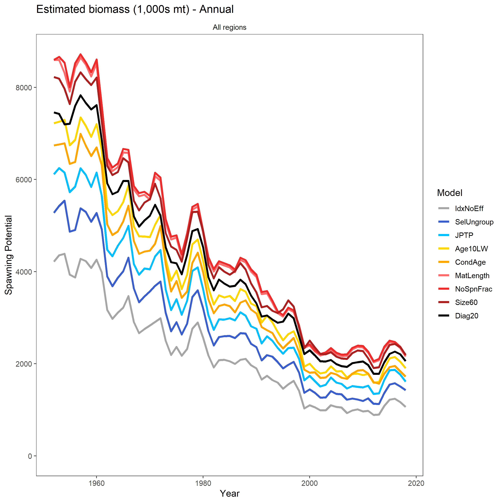
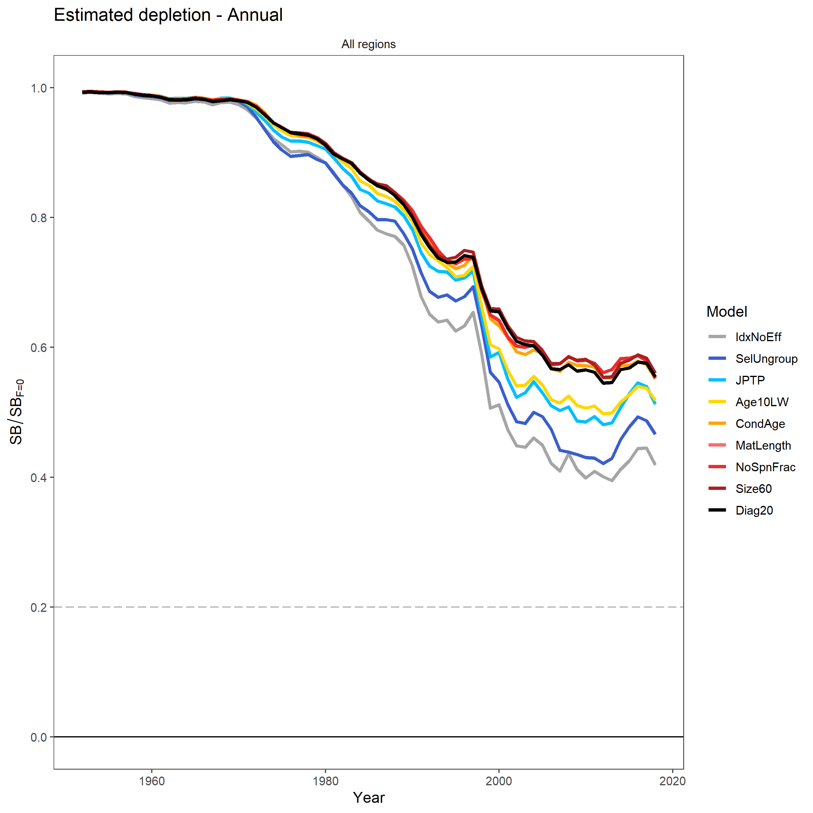

# Review Topics

&nbsp;&nbsp;&nbsp;&nbsp;

Step       | Report | Penguin | Effect on SBSBF0 | Effect on SB  | Review focus
---------- | ------ | ------- | ---------------- | ------------- | ---------------------------
Diag17     |      1 |       - |                  |               |
NewExe     |      2 |       1 |                  |               |
TagGrp     |      3 |       2 |                  |               |
Update     |      4 |       3 |                  |               |
PeatmanPS  |      5 |       4 |                  |               |
GeoStats   |      6 |       5 |                  |               |
SizeComp   |      7 |       6 |                  |               |
Index      |      8 |       7 |                  |               |
Idx-NoEff  |      9 |       8 |                  |               |
SelUngroup |     10 |      9c |               ++ |            ++ | **needs review**
JPTP       |     11 |      12 |               ++ |            ++ | jp tags, don't touch
Age 10-LW  |     12 |   13+14 |                  |            ++ | what is appropriate max age
CondAge    |     13 |      15 |               ++ |            -- | otoliths, don't touch
MatLength  |     14 |      16 |                  |           +++ | big effect on SB, review
NoSpnFrac  |     15 |      17 |                  |               |
Size60     |     16 |         |                  |               |
Diag20     |     17 |         |                - |             - | 0 selectivity for age 1 qtr
